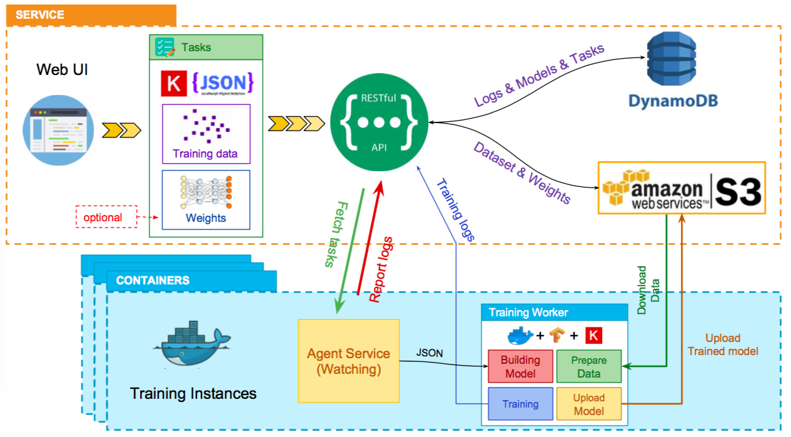
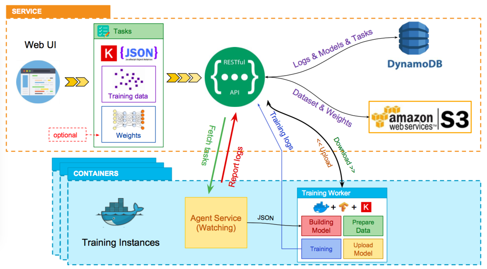
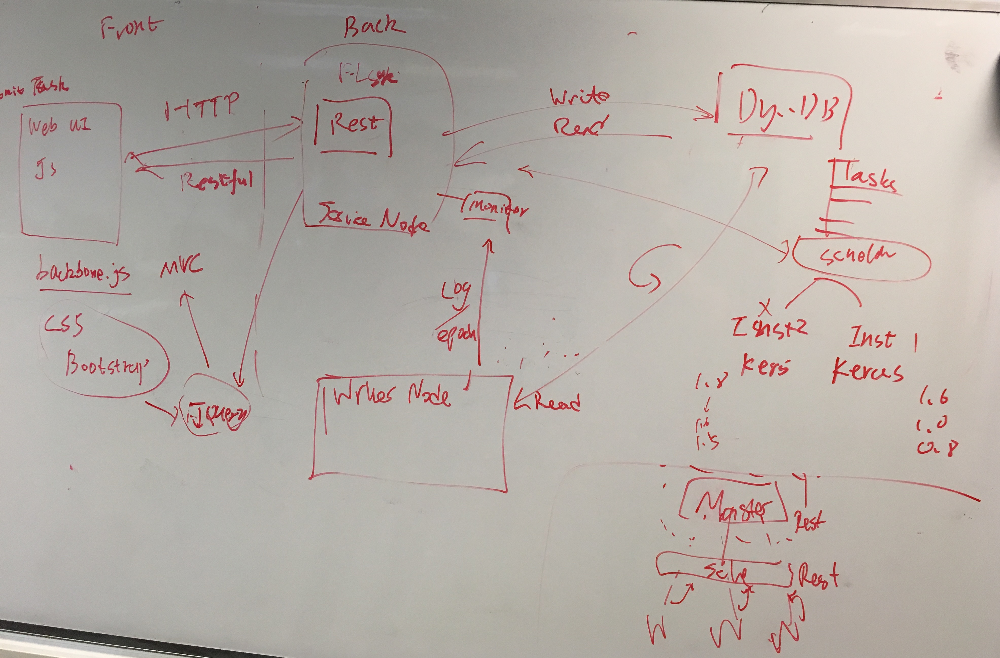

insight-workarea
===========================

My development area during my time as a AI Fellow at Insight

Author
----------------------------------

Ryan Reece <ryan.reece@cern.ch>     
Created: January 12, 2018

Ideas
----------------------------------

See also
----------------------------------

-   <http://insightdata.ai/>
-   <https://github.com/JMHOO/planet-insight>

Mess
----------------------------------

-   <https://spin.atomicobject.com/2014/06/24/gradient-descent-linear-regression/>
-   <https://github.com/bdhammel/ml-cliff-notes>
-   <https://github.com/sravya8/ML>

